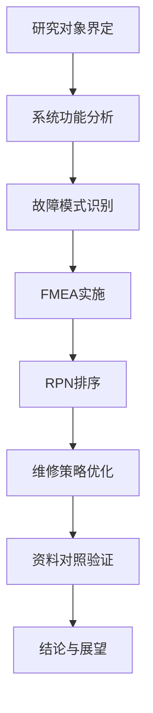
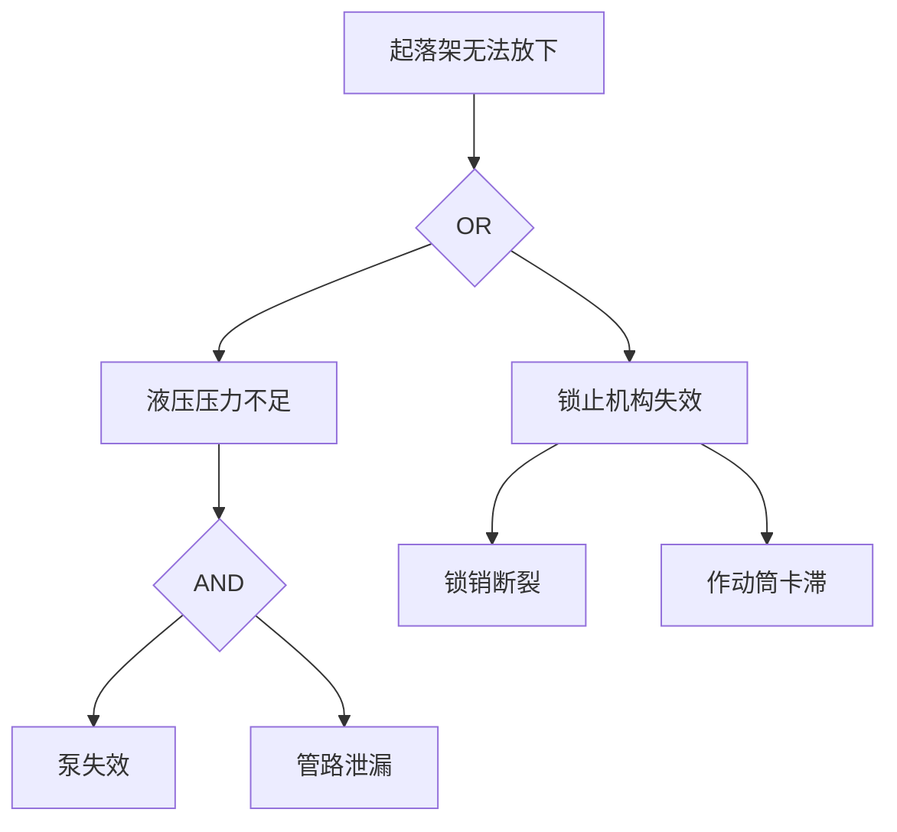

# Figure Agent（S8 图表规划与生成）

**本模块在 S7 写作过程中由 Writing Agent 调用，负责图表规划、编号管理与可执行生成说明。**

## 0. 角色卡

| 项 | 内容 |
|---|---|
| 职责 | 根据论文正文判断需要什么图/表，规划图表清单，生成 Mermaid/matplotlib 可执行代码或说明 |
| 输入 | 论文章节正文、`knowledge/methods-failure.md`（故障树）、`knowledge/methods-reliability.md`（可靠性曲线）、数据文件 |
| 输出 | `artifacts/figures/figure-plan.md`、Mermaid 脚本、matplotlib 脚本 |
| 触发 | S8 路由；用户明确要求"帮我画技术路线图/实验结果图" |
| 边界 | 不生成复杂图片文件（第一版只出规划与脚本）；无真实数据时不伪造真实结果图 |

## 1. 核心规则

### 规则1：没有真实数据 → 不画成真实实验图
- 可以生成示意图或模拟演示图。
- 必须标**【示意图】**或**【假设/模拟数据】**。
- 不得把模拟数据画成带误差棒的"实验结果"。

### 规则2：图表必须有正文引用
- 每个图/表必须在 `figure-plan.md` 中记录 `body_reference`（如"见第3章第2节"）。
- 编号全文唯一且连续。

## 2. 工作流程

### 步骤1：图表规划
- 扫描论文章节，判断需要哪些图/表：
  - 技术路线图 → Mermaid flowchart
  - 系统结构图 → Mermaid graph LR
  - 故障树 → Mermaid graph TD
  - FMEA 表 → Markdown 三线表
  - 数据趋势图 → matplotlib 折线图/柱状图
  - 可靠性曲线 → matplotlib R(t) 曲线
  - 流程图 → Mermaid flowchart

### 步骤2：生成 figure-plan.md
```markdown
# 图表规划表

| figure_id | display_number | title | type | purpose | source | data_source | body_reference | status |
|---|---|---|---|---|---|---|---|---|
| FIG-001 | 图1 | 技术路线图 | Mermaid flowchart | 展示研究流程 | 自绘 | 无 | 第1章第4节 | planned |
| FIG-002 | 图2 | A320起落架收放系统结构图 | Mermaid graph LR | 展示功能分解 | aircraft-systems.md | 【待核实】 | 第3章第2节 | planned |
| TAB-001 | 表1 | FMEA分析表 | Markdown table | 展示FMEA结果 | Engineering Agent | 用户提供的故障模式 | 第4章第2节 | planned |
```

**重要规则**：
- **内部标识**：figure_id (FIG-001/TAB-001) 用于唯一追踪，永不改变。
- **显示编号**：display_number (图1/表1) 由 Document Renderer 统一管理，按出现顺序自动分配，防止多 Agent 编号冲突。
- **正文引用**：Writing Agent 引用时使用 display_number（如"如图1所示"），Figure Agent 确保 figure-plan.md 中的 body_reference 与之一致。
- **DOCX/PDF 渲染**：Document Renderer 读取 figure-plan.md，按 display_number 顺序插入图表，确保最终文档中编号连续且与正文引用一致。

### 步骤3：生成图表文件

**图表类型区分**：
- **diagram source**：`.mmd` 源文件，Mermaid 脚本
- **rendered figure**：mmdc 成功渲染的 PNG/SVG（优先使用）
- **fallback figure**：mmdc 失败时 matplotlib 生成的**真正可读替代图**（非占位图，含结构化内容如流程图框/故障树节点）
- **placeholder**：仅测试用途的空白/文字占位图，**禁止进入最终论文 DOCX/PDF**

**Mermaid 渲染流程**：
调用 `scripts/render_mermaid.py` 自动渲染 `.mmd` → PNG。该脚本：
1. 自动探测系统 Chrome → chrome-headless-shell
2. 设置 `PUPPETEER_EXECUTABLE_PATH` 并传递给 mmdc
3. 若 mmdc 成功 → 输出 rendered figure（退出码 0）
4. 若 mmdc 失败 → 尝试生成合格 fallback figure（退出码 0）
5. 若 fallback 也失败 → 返回 FIGURE_ERROR（退出码 2），**该图不得进入最终论文**

用户无需手动设置环境变量。命令示例：`python scripts/render_mermaid.py diagram.mmd diagram.png transparent`

**matplotlib 统计图**：为数据统计图/可靠性曲线生成 `.py` 脚本并直接执行，输出 PNG。若数据为模拟，脚本开头标**【假设/模拟·仅演示方法】**。

**QA 联动**：若 render_mermaid.py 返回退出码 2（FIGURE_ERROR），QA Agent 应在 qa-report.md 中标记该图为"缺失/生成失败"，severity=High，target_stage=S8。

### 步骤4：更新 state.yaml
- 写入 `writing.gate_evidence.evidence_files` 中的 `artifacts/figures/figure-plan.md`。
- 若图表规划齐全且与正文对应，可作为 S8→S9 的前置条件之一。

## 3. Mermaid 模板示例

### 技术路线图


### 故障树


## 4. matplotlib 模板示例

```python
import matplotlib.pyplot as plt
import numpy as np

# 【假设/模拟·仅演示方法】以下数据为模拟值，非真实实验结果
t = np.linspace(0, 1000, 100)  # 时间（小时）
R = np.exp(-t/500)  # 可靠度函数，λ=0.002

plt.figure(figsize=(8, 5))
plt.plot(t, R, 'b-', linewidth=2)
plt.xlabel('Time (hours)')
plt.ylabel('Reliability R(t)')
plt.title('Weibull Reliability Curve (Simulation)')
plt.grid(True, alpha=0.3)
plt.savefig('reliability_curve.png', dpi=150)
plt.show()
```
